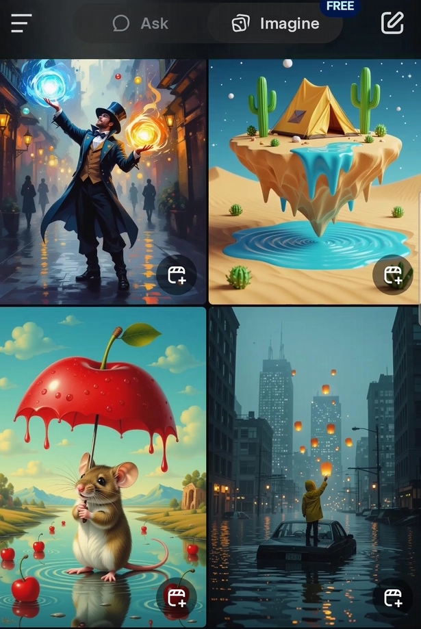
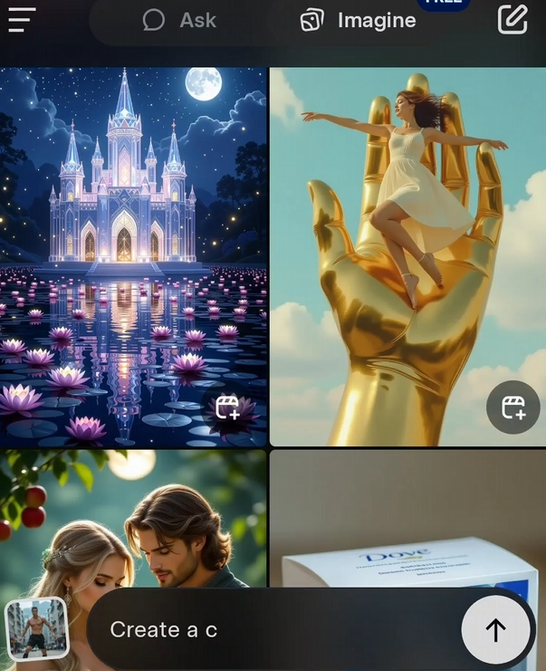
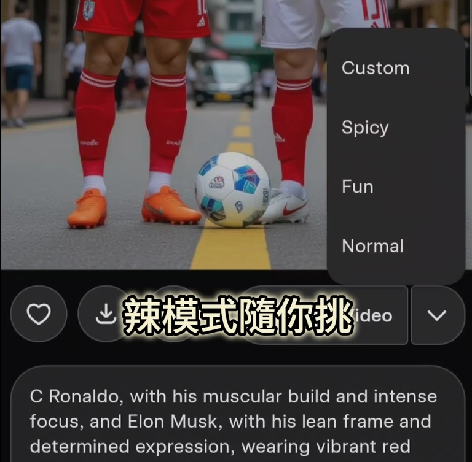

# Grok Imagine新手指南：免费用Grok 4生成图片和视频，真的不难

---

想玩AI生成图片和视频，但不知道从哪下手？听说过Grok Imagine，但担心要付费？或者试了几次，生成的东西总是差强人意？别慌，这篇文章就是写给你的。我们从零开始，聊聊怎么用Grok Imagine——最重要的是，Grok 4现在完全免费，新手完全可以放心折腾。

---

## 什么是Grok Imagine？先搞清楚这个工具是干嘛的

简单说，Grok Imagine就是一个"文字变图片、图片变视频"的AI工具。它是xAI（对，就是马斯克那家AI公司）开发的，背后用的是Aurora模型。你输入一段描述，它就能给你生成图片；甚至可以把图片转成短视频，还能自动加音效。

听起来挺高端，但用起来其实没那么复杂。

和其他AI工具比起来，Grok Imagine最大的亮点就是**免费**和**不限次数**。很多同类工具要么要订阅会员，要么每天只能生成几次。Grok Imagine目前完全开放，包括高级功能Grok 4也能免费用。这大概是xAI为了抢市场的策略——2025年8月刚推出，全球可用（香港用户不用翻墙，部分地区可能还需要）。

## Grok 4免费用？怎么开始

好消息是，Grok 4现在对所有人免费，没有时间限制，也没有每日配额（至少目前是这样）。之前Grok 4只对SuperGrok或Premium+会员开放，但从2025年8月11日起，xAI宣布免费用户也能用Auto模式——系统会自动切换到Grok 4处理复杂问题。想更精准控制？直接选Expert模式就行。

开始很简单：

1. 下载Grok App（iOS或Android都有）
2. 注册一个X账号（Grok Imagine绑定在X平台上）
3. 打开App，点"Imagine"按钮，开始创作

新手常问："免费版有什么限制？"目前没有明确的使用上限，不过测试阶段可能偶尔会遇到生成变慢或质量不稳定的情况。有了Grok 4的免费权限，你可以生成4K高清图片，甚至带音效的6秒短视频。记得把App更新到最新版本（v1.1.55），才能体验所有新功能。

## 四种模式怎么选？别被选项搞晕

Grok Imagine提供四种模式：

- **Normal模式**：适合全年龄内容，适合大部分场景
- **Fun模式**：生成效果更幽默夸张，适合玩梗
- **Custom模式**：可以更精细地控制输出结果
- **Spicy模式**：面向成人内容，不过有用户反映，生成或查看"辣"一点的内容可能需要付费计划

新手建议从Normal模式开始，熟悉了再试试其他模式。

如果你想更稳定地使用高级功能，也可以考虑 👉 [升级到Grok Super会员，获取更流畅的创作体验和更多专属权益](https://shaoyumi.com/buy/66)——不过对于刚入门的用户来说，免费版已经完全够用了。

## 新手最容易踩的坑：为什么生成效果不理想？

很多人第一次用Grok Imagine，生成的图片或视频总觉得"不对劲"。其实不是工具不行，是描述不够具体。

举个例子：
- ❌ "一只猫"
- ✅ "一只橘色短毛猫，坐在木质窗台上，阳光从窗户洒进来，背景是绿色植物"

看出区别了吗？越具体，生成效果越接近你的想象。颜色、场景、光线、动作——这些细节都可以写进去。

另一个常见问题是"为什么视频只有6秒？"目前Grok Imagine生成的视频确实只有6秒，这是技术限制。不过6秒其实够用了——短视频平台上很多爆款内容也就几秒钟。关键是内容有趣，不是时长。

## 写在最后：别怕折腾，AI工具就是用来玩的

Grok Imagine的免费开放，对新手来说是个好机会。不用担心试错成本，也不用纠结"会不会浪费配额"。打开App，随便输入几个想法，看看能生成什么——可能第一次不满意,多试几次,你会发现自己越来越上手。

如果你是内容创作者、设计爱好者，或者只是想玩点新东西，Grok Imagine都值得一试。👉 [想要更稳定的高级体验？Grok Super会员一个月成品号让你免去排队和限速烦恼](https://shaoyumi.com/buy/66)，但说实话，免费版对大多数人来说已经足够了。

别想太多,先动手试试。AI工具最大的乐趣,就是不断试错和发现惊喜。
